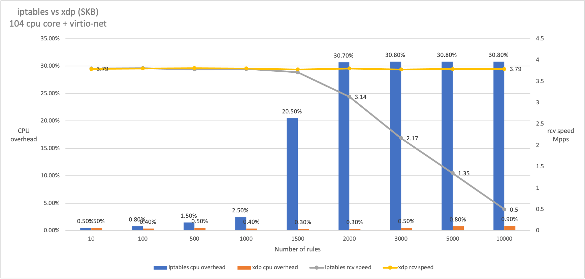
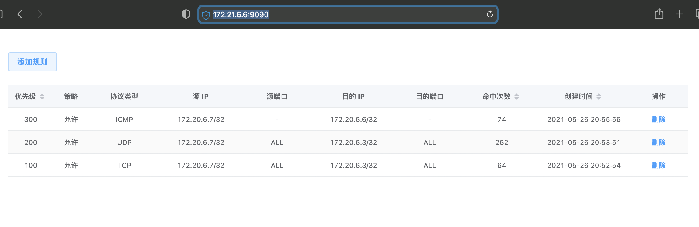

#### Benchmarks

Performance comparison test of dropping 64 byte syn packet


#### Notice
* Linux kernel required: v5.4 or later
* [How to upgrade kernel quickly ?](./docs/environment/upgrade_kernel.md)

#### Environment
* [Build development environment basied on VMs](./docs/environment/build_on_VMs) (Recommended)
* [Build development environment basied on Docker image](./docs/environment/build_on_docker)
* [Build development environment basied on Host](./docs/environment/build_on_host)

#### Get Started

Download directly from release tab or compile by yourself.

```
# Compile
$ make

# Get help
./xdp_acl -h

# Start (Inner web server will default listen on 0.0.0.0:9090).
./xdp_acl -D eth1 -S
```

#### Web console



